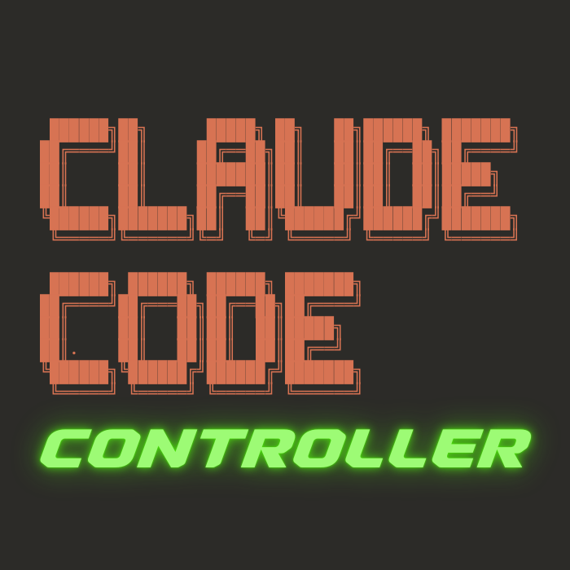
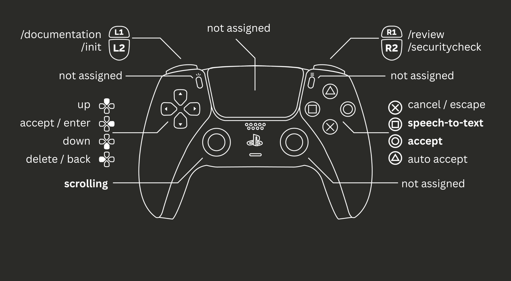

# Claude Code Controller 🎮

Transform your PS5 DualSense controller into a powerful navigation and command tool for Claude Code. Navigate and execute commands with gamepad precision.



## ✨ Features

- **🎯 Precise Navigation**: Use D-Pad for arrow key navigation in Claude Code
- **⚡ Quick Commands**: Execute Claude commands instantly with button combos
- **🎙️ Voice Input**: Speech-to-text integration for natural language commands
- **📊 Real-time Feedback**: Visual button state indicators and connection status
- **🔧 Custom Commands**: Install and manage custom Claude command shortcuts
- **💡 DualSense Integration**: Full haptic feedback and light bar support

## 🚀 Installation

### Quick Install (Recommended)

1. **Download the latest release:**
   - Go to [Releases](https://github.com/yourusername/Claude-Code-Controller/releases/latest)
   - Download `ClaudeCodeController.zip`

2. **Install the app:**
   ```bash
   # Unzip the downloaded file
   unzip ~/Downloads/ClaudeCodeController.zip
   
   # Move to Applications folder
   mv ClaudeCodev2.app /Applications/
   ```

3. **First launch (Important!):**
   - Right-click the app in Applications
   - Select "Open" from the context menu
   - Click "Open" in the security dialog
   - This bypass is only needed once!

4. **Grant permissions:**
   - Go to System Preferences → Security & Privacy → Privacy
   - Add Claude Code Controller to:
     - Accessibility (required for keyboard simulation)
     - Bluetooth (for controller connection)
     - Microphone (optional, for voice input)

### Prerequisites
- macOS 12.0 or later
- PS5 DualSense Controller
- Bluetooth enabled on your Mac

### Build from Source (Alternative)

1. Clone the repository:
```bash
git clone https://github.com/yourusername/Claude-Code-Controller.git
cd Claude-Code-Controller/ClaudeCodev2
```

2. Open in Xcode:
```bash
open ClaudeCodev2.xcodeproj
```

3. Build and run:
   - Press `Cmd+B` to build
   - Press `Cmd+R` to run

### First-Time Setup

1. **Grant Permissions**:
   - Bluetooth access (for controller connection)
   - Accessibility permission (System Preferences → Security & Privacy → Privacy → Accessibility)
   - Microphone access (for speech input, optional)

2. **Connect Your Controller**:
   - Open System Preferences → Bluetooth
   - Put DualSense in pairing mode (hold PS + Share buttons)
   - Click "Connect" when the controller appears

3. **Install Custom Commands**:
   - Launch Claude Code Controller
   - Navigate to the Configuration tab
   - Click "Install Custom Claude Commands"

## 🎮 Controller Mappings



### Navigation Controls

| Button | Action |
|--------|--------|
| **D-Pad** | Arrow keys navigation |
| **Circle (○)** | Enter/Accept |
| **Cross (✕)** | Escape/Cancel |
| **Triangle (△)** | Auto-accept (Cmd+Enter) |
| **Square (□)** | Type `/` for commands |
| **Left Stick** | Additional navigation |
| **Right Stick** | Scroll navigation |

### Command Buttons

| Button | Command |
|--------|---------|
| **L1** | `/init` - Initialize Claude in current directory |
| **R1** | `/review` - Request code review |
| **R2** | `/test` - Run tests |
| **L2** | `/securitycheck` - Security analysis |

### Special Functions

| Control | Action |
|---------|--------|
| **Options** | Settings/Configuration |
| **Share** | Toggle features |
| **Touchpad Press** | Toggle voice input |
| **PS Button** | System functions |

## 📱 App Interface

The app features a clean SwiftUI interface with two main tabs:

### Controller Tab
- Real-time button state visualization
- Active button highlighting
- Command mappings display
- Connection status with helpful instructions

### Status Tab
- Detailed connection information
- Step-by-step setup guide
- Troubleshooting tips
- Custom command installation

## 🔧 Configuration

### Custom Commands

The app can install helpful Claude commands to your shell configuration:

- **`init`**: Initialize Claude in the current directory
- **`review`**: Request a code review
- **`test`**: Run tests
- **`securitycheck`**: Perform security analysis
- **`documentation`**: Generate documentation

These commands are automatically added to your shell profile (`~/.zshrc` or `~/.bash_profile`).


## 🏗️ Architecture

Built with modern Swift and SwiftUI:

- **SwiftUI**: Native macOS app with reactive UI
- **GameController Framework**: DualSense integration
- **CoreGraphics**: Keyboard event simulation
- **Speech Framework**: Voice-to-text conversion
- **Combine**: Reactive state management

## 🤝 Contributing

Contributions are welcome! Please feel free to submit a Pull Request.

1. Fork the repository
2. Create your feature branch (`git checkout -b feature/AmazingFeature`)
3. Commit your changes (`git commit -m 'Add some AmazingFeature'`)
4. Push to the branch (`git push origin feature/AmazingFeature`)
5. Open a Pull Request

## 📝 License

This project is licensed under the MIT License - see the [LICENSE](LICENSE) file for details.

## 🙏 Acknowledgments

- Built for enhancing the Claude Code experience
- Inspired by the need for more intuitive code navigation
- Thanks to the Swift and GameController framework communities

## 🐛 Troubleshooting

### Installation Issues

**"App is damaged and can't be opened"**
- This happens because the app isn't signed with Apple's certificate
- Solution: Right-click → Open (don't double-click)
- Alternative: Run in Terminal: `xattr -cr /Applications/ClaudeCodev2.app`

**"Claude Code Controller can't be opened because Apple cannot check it for malicious software"**
- This is expected for free, unsigned software
- Solution: Right-click the app → Select "Open" → Click "Open" in the dialog

### Controller Not Connecting
1. Ensure Bluetooth is enabled
2. Reset controller (small button on back)
3. Remove and re-pair in Bluetooth settings

### Commands Not Working
1. Grant Accessibility permission in System Preferences
2. Ensure Claude Code is the active application
3. Check that custom commands are installed

### No Response from Buttons
1. Check the app's status tab for connection info
2. Verify controller battery level
3. Try reconnecting the controller

## 📧 Support

For issues, questions, or suggestions, please open an issue on GitHub.

---

Made with ❤️ for the Claude Code community